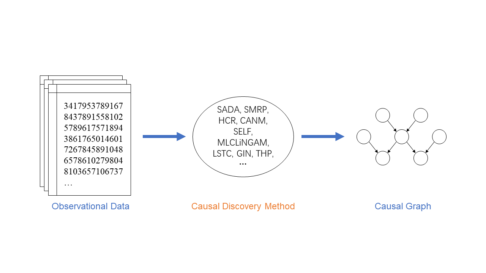

# CDMIR: Causal Discovering, ModelIng and Reasoning

CDMIR (Causal Discovering, ModelIng and Reasoning) is a repository for providing causality papers from [DMIR Lab](https://dmir.gdut.edu.cn/), GDUT. These papers are related works on causal discovery from observational data and its application, especially with latent variables, non-iid. data and so on.

### Contents

- [1. Causal Discovery](#1-causal-discovery)
  - [1.1 Without Latent Variable](#11-without-latent-variables)
  - [1.2 With Latent Variable](#12-with-latent-variables)
  - [1.3 With Non-iid Data](#13-with-non-iid-data)
- [2. Causality-Related Learning](#2-causality-related-Learning)
- [3. Application of Causal Discovery](#3-application-of-causal-discovery)

## 1.  Causal Discovery

### 1.1 Without Latent Variables

1. Ruichu Cai, Zhenjie Zhang, Zhifeng Hao. SADA: A General Framework to Support Robust Causation Discovery, ICML 2013 [[pdf](http://proceedings.mlr.press/v28/cai13.pdf)].
2. Mei Liu, Ruichu Cai (co-first author), Yong Hu, Michael E Matheny, Jingchun Sun, Jun Hu, Hua Xu. Determining molecular predictors of adverse drug reactions with causality analysis based on structure learning, Journal of the American Medical Informatics Association, 2013 [pdf]
3. Ruichu Cai, Zhenjie Zhang, Zhifeng Hao. Causal Gene Identification Using Combinatorial V-Structure Search, Neural Networks. 2013;43:63-71[pdf].
4. Ruichu cai, Zhenjie Zhang, Zhifeng Hao, Marianne Winslett.  Sophisticated Merging over Random Partitions: A Scalable and Robust Causal Discovery Approach. IEEE Transactions on Neural Networks and Learning Systems,2017
5. Ruichu Cai, Mei Liu, Yong Hu , Brittany L. Melton, Michael E. Matheny,Hua Xu, Lian Duan, Lemuel R. Waitman. Identification of adverse drug-drug interactions through causal association rule discovery from spontaneous adverse event reports. Artificial Intelligence in Medicine 76 (2017) 7–15[[code](https://drive.google.com/open?id=1FQAzzAZTa1XOd_plsSLsVMUOD4sebK7q)]
6. Ruichu Cai, Jie Qiao, Kun Zhang, Zhenjie Zhang, Zhifeng Hao. Causal Discovery on Discrete Data using Hidden Compact Representation. NIPS,2018. [[pdf](https://proceedings.neurips.cc/paper/2018/file/8d3369c4c086f236fabf61d614a32818-Paper.pdf)] [[code](https://cran.r-project.org/web/packages/HCR/index.html)]
7. Ruichu Cai, Jie Qiao, Zhenjie Zhang, Zhifeng Hao. SELF: Structural Equational Embedded Likelihood Framework for Causal Discovery. AAAI,2018. [[pdf](https://www.aaai.org/ocs/index.php/AAAI/AAAI18/paper/viewFile/17050/15881)] [[code](https://github.com/DMIRLAB-Group/SELF)]
8. Ruichu Cai, Jie Qiao, Kun Zhang, Zhenjie Zhang, Zhifeng Hao.  Causal Discovery with Cascade Nonlinear Additive Noise Model.  IJCAI 2019 [[pdf](https://www.ijcai.org/proceedings/2019/0223.pdf)] [[code](https://github.com/DMIRLAB-Group/CANM)]

### 1.2 With Latent Variables

1. Ruichu Cai, Feng Xie, Clark Glymour, Zhifeng Hao, Kun Zhang. Triad Constraints for Learning Causal Structure of Latent Variables. NeurIPS 2019  [[pdf](https://proceedings.neurips.cc/paper/2019/file/8c66bb19847dd8c21413c5c8c9d68306-Paper.pdf)] [[code](https://github.com/xiefeng009/Triad-Constraints-for-Learning-Causal-Structure-of-Latent-Variables)]
2. Feng Xie#, Ruichu Cai#, Biwei Huang, Clark Glymour, Zhifeng Hao, Kun Zhang#. Generalized Independent Noise Condition for Estimating Linear Non-Gaussian Latent Variable Graphs. NeurIPS 2020 [[pdf](https://proceedings.neurips.cc/paper/2020/file/aa475604668730af60a0a87cc92604da-Paper.pdf)] [[code](https://github.com/xiefeng009/GIN-Condition-for-Estimating-Latent-Variable-Causal-Graphs)]
3. Chen, W., Cai, R., Zhang, K., & Hao, Z. (2021). Causal Discovery in Linear Non-Gaussian Acyclic Model With Multiple Latent Confounders. *IEEE Transactions on Neural Networks and Learning Systems*. [[pdf](https://ieeexplore.ieee.org/document/9317707)]

### 1.3 With Non-iid Data

1. Zeng, Y., Shimizu, S., Cai, R., Xie, F., Yamamoto, M., & Hao, Z. (2020). Causal discovery with multi-domain LiNGAM for latent factors. *arXiv preprint arXiv:2009.09176*. [[pdf](https://www.ijcai.org/proceedings/2021/0289.pdf)]
2. Cai, R., Wu, S., Qiao, J., Hao, Z., Zhang, K., & Zhang, X. (2021). THP: Topological Hawkes Processes for Learning Granger Causality on Event Sequences. *arXiv preprint arXiv:2105.10884*. [[pdf](https://arxiv.org/pdf/2105.10884.pdf)]

## 2. Causality-Related Learning

1. Ruichu Cai, Zijian Li, Pengfei Wei, Jie Qiao, Kun Zhang, Zhifeng Hao.  Learning Disentangled Semantic Representation for Domain Adaptation.  IJCAI 2019 [[pdf](https://www.google.com/url?q=https%3A%2F%2Fwww.ijcai.org%2FProceedings%2F2019%2F0285.pdf&sa=D&sntz=1&usg=AFQjCNGRqQARRdC3L_ielOasW1P0sVuqfQ)] [[code](https://www.google.com/url?q=https%3A%2F%2Fgithub.com%2FDMIRLAB-Group%2FDSR&sa=D&sntz=1&usg=AFQjCNHNnZr-FPej3zlQdnMAOXghzieLGg)]
2. Ruichu Cai, Jiahao Li, Zhenjie Zhang, Xiaoyan Yang, Zhifeng Hao.  DACH: Domain Adaptation without Domain Information. IEEE Transactions on Neural Networks and Learning Systems, 2020:31(12):5055-5067 [[pdf](https://ieeexplore.ieee.org/document/8963871)]
3. Ruichu Cai, Jiawei Chen, Zijian Li, Wen Chen, Keli Zhang, Junjian Ye, Zhuozhang Li, Xiaoyan Yang, Zhenjie Zhang. Time Series Domain Adaptation via Sparse Associative Structure Alignment, AAAI 2021 [[pdf](https://www.aaai.org/AAAI21Papers/AAAI-2751.CaiR.pdf)] [[code](https://github.com/DMIRLAB-Group/SASA)]
4. Zijian Li, Ruichu Cai*, Hongwei Ng, Marianne Winslett, Tom Z. J. Fu, Boyan Xu, Xiaoyan Yang, Zhenjie Zhang. Causal Mechanism Transfer Network for Time Series Domain Adaptation in Mechanical Systems[J]. ACM Transactions on Intelligent Systems and Technology, 2021

## 3. Application of Causal Discovery

1. Ruichu Cai, Zhenjie Zhang, Zhifeng Hao. BASSUM:A Bayesian semi-supervised method for classification feature selection,Pattern Recognition. 2011;44(4):811-820(SCI:711BV)
2. Ruichu Cai, Zhenjie Zhang, Zhifeng Hao, Marianne Winslett. Understanding Social Causalities Behind Human Action Sequences. IEEE Transactions on Neural Networks and Learning Systems. 2017,28(8):1801-1813. 
