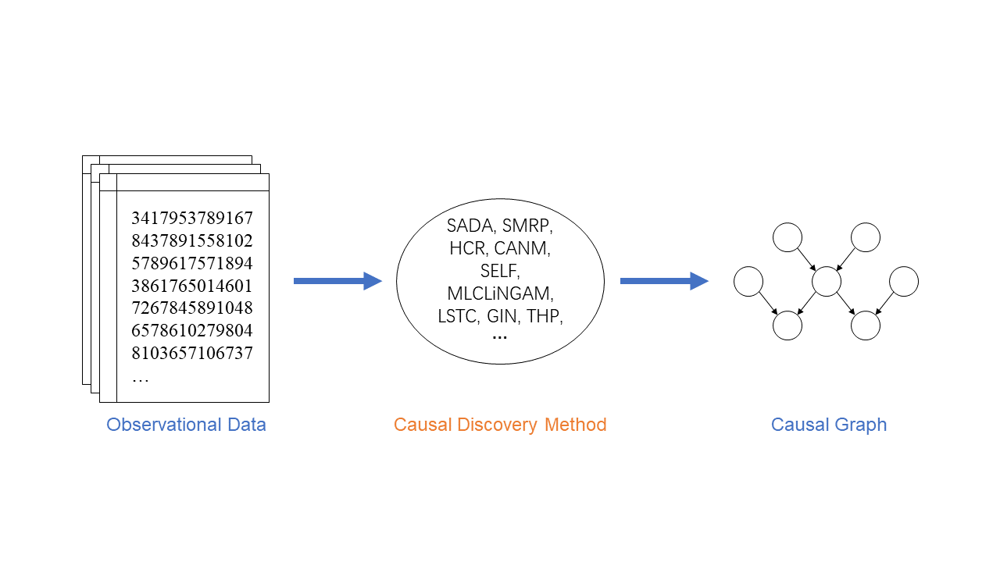

# CDMIR: Causal Discovery, Modeling and Reasoning 

CDMIR is a python package for causal discovery, modeling and reasoning that is developed from [DMIR Lab](https://dmir.gdut.edu.cn/), GDUT. 

The package is under active development. Feedbacks (issues, suggestiong, etc.) are highly encouraged.

## Requirements

- Python3
- numpy
- pandas
- scipy>=1.7.3
- scikit-learn
- torch>=1.7.1
- networkx
- matplotlib
- tick

## Contributors

Team Leaders: Ruichu Cai, Zhifeng Hao

Coordinators: Wei Chen

Thanks to the following developers for this project:

- [@chenweiDelight](https://github.com/chenweiDelight)
- [@zhi-yi-huang](https://github.com/zhi-yi-huang)
- [@miumiujiang12138](https://github.com/miumiujiang12138)
- [@WeilinChen507](https://github.com/WeilinChen507) 
- [@wean2016](https://github.com/wean2016) 
- [@Jie-Qiao](https://github.com/Jie-Qiao)  
- [@jinshi201](https://github.com/jinshi201) 
- [@kanseaveg](https://github.com/kanseaveg) 
- [@Boyle-Coffee](https://github.com/) 

Please feel free to open an issue if you find anything unexpected. And please create pull requests, perhaps after passing unittests in 'tests/', if you would like to contribute to cdmir. We are always targeting to make our community better!
